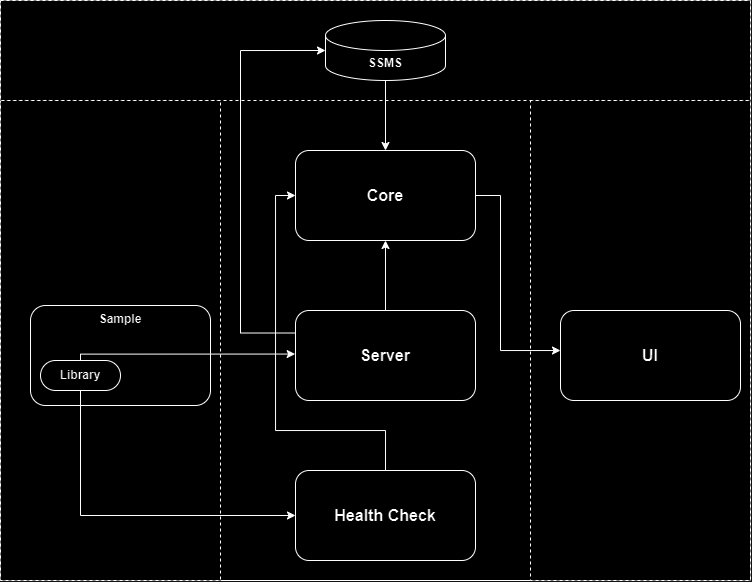

# LESSLA

<h1 align="center">
  <br>
  
  <br>
</h1>

<h4 align="center">Lessla is a central logging system to unify logging across multiple applications with actual insightful data.</h4>

<br/>

## Overview

<h1 align="center">
  <br>
  
  <br>
</h1>

<br/>

## Features

There are few neat futures of LESSLA and you might think it's the definition of `ReInVeNtInG tHe wHeEL` might be yes, but I took into account the cabibility to monitor mutiple applications with least amount of LOC possible and neat insightful logs.

- Log aggregation
- Health check

## Deployment Checklist

- Deploy Server Instance
- Deploy UI Instance

<br/>

## Database Permission

On SSMS Server run

```bash
ALTER DATABASE lessla SET ENABLE_BROKER
```

## Hooking up with the server

To be able to integerate with the server, install below `Nuget` packages

- `Serilog.AspNetCore`
- `Serilog.Enrichers.Environment`
- `Serilog.Exceptions`
- `Serilog.Sinks.Http`

<br/>

Setup serilog in `Program.cs`

<br/>

```csharp
builder.Host.UseSerilog();
Log.Logger = new LoggerConfiguration()
    .ReadFrom.Configuration(
    new ConfigurationBuilder().SetBasePath(Directory.GetCurrentDirectory())
        .AddJsonFile("appsettings.json", optional: false, reloadOnChange: true)
        .AddJsonFile($"apsettings.{Environment.GetEnvironmentVariable("DOTNET_ENVIRONMENT") ?? "Production"}.json", optional: true, reloadOnChange: true)
        .AddEnvironmentVariables().Build()
    ).CreateLogger();
```

<br/>

And put below in `appsettings.json`

<br/>

```json
  "Serilog": {
    "Using": [ "Serilog.Sinks.Http", "Serilog.Exceptions" ],
    "MinimumLevel": "Error",
    "WriteTo": [
      {
        "Name": "DurableHttpUsingFileSizeRolledBuffers",
        "Args": {
          "requestUri": "http***********"
        }
      }
    ],
    "Enrich": [ "FromLogContext", "WithExceptionDetails" ],
    "Properties": {
      "Application": "Sample"
    }
  },
  "Lessla": {
    "HealthCheck": {
      "endpoints": [
        "http***********"
      ]
    }
  }
```

<br/>

## Deployment Requirements

- SSMS Server
- .NET 7

<br/>

# Road Map

- [x] Durable logger on client and server sides
- [ ] Notification center
- [ ] Logger insights for dashboard
- [ ] Health check center
- [ ] LLama integration

<br/>

> :warning: **Project was tested on .NET 7 projects**
